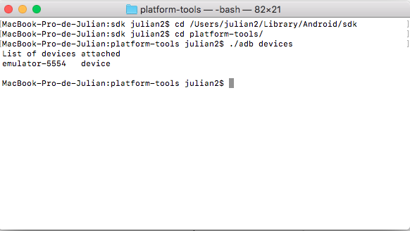

# MISO-AT-Workshop4
Monkey Testing en aplicaciones móviles y web

https://miso-4208-labs.gitlab.io/talleres/taller4.html

## Rippers ad-hoc con Cypress.io

Prueba del taller:

Trabajo propuesto:

## Random Testing con gremlins.js

Importando proyecto e instalando dependencias:

Error por versión del NodeJS, se actualiza a la v.8.9.4 y se vuelve a instalar los paquetes "npm install"

Prueba del taller:

Trabajo propuesto:

## UI/Application Exerciser Monkey en Android

Consulta Devices

Random Testing TransmiSITP

Random Testing OmniNotes (App del proyecto)

